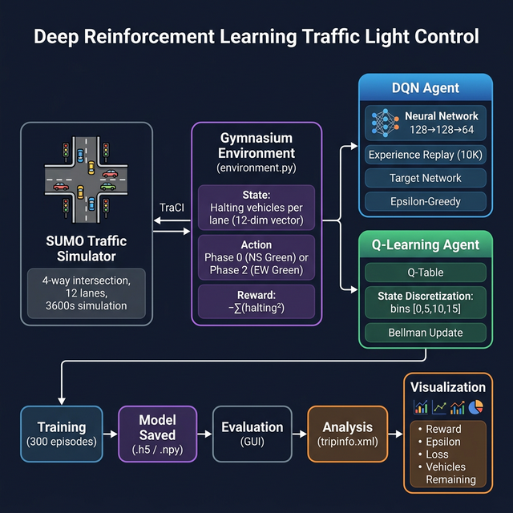
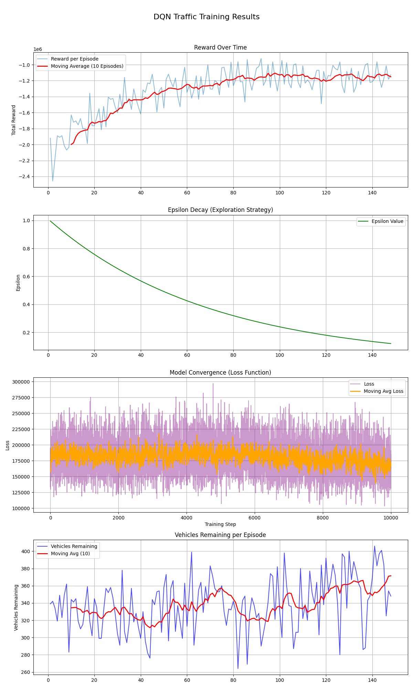

# 🚦 Intelligent Traffic Light Control using DQN & Q-Learning

A reinforcement learning system that learns to **optimize traffic signal timing** at a 4-way intersection using **SUMO** traffic simulator. Compares two RL approaches: **Deep Q-Network (DQN)** with neural networks and **Tabular Q-Learning** with state discretization.


---

## ✨ Features

- 🤖 **Two RL Algorithms** — Compare DQN (deep learning) vs Q-Learning (tabular) on the same environment
- 🚗 **Realistic Simulation** — Powered by SUMO (Simulation of Urban Mobility) with 4-way intersection and 12 lanes
- 📊 **Training Visualization** — Track reward, epsilon decay, loss convergence, and vehicles remaining
- 📈 **Performance Analysis** — Parse SUMO `tripinfo.xml` for average travel time, waiting time, and time loss
- 🎮 **GUI Evaluation** — Visualize trained agent controlling traffic in SUMO-GUI
- ⏹️ **Early Stopping** — Automatically stops DQN training when no improvement is detected

---

## 🏗️ System Pipeline



The system follows the standard RL loop:

1. **SUMO Simulator** generates realistic traffic at a 4-way intersection (12 incoming lanes, 3 per direction)
2. **Gymnasium Environment** wraps SUMO via TraCI — observes halting vehicles and controls traffic light phases
3. **RL Agent** (DQN or Q-Learning) selects actions based on current state using epsilon-greedy policy
4. **Training Loop** runs for 300 episodes (each episode = 3600s of simulated traffic)
5. **Evaluation** loads the trained model and runs with GUI visualization

---

## 🧠 MDP Formulation

| Component | Details |
|-----------|---------|
| **State** | 12-dim vector — number of halting vehicles on each incoming lane `[E1_0, E1_1, E1_2, N1_0, ..., S1_2]` |
| **Action** | `0` = North-South green phase, `1` = East-West green phase |
| **Reward** | `-Σ(halting²)` — penalizes congestion quadratically (heavier penalty for severe jams) |
| **Episode** | 3600 seconds of simulation (1 hour of traffic) |
| **Step** | 10 SUMO simulation steps per RL step |

---

## ⚔️ DQN vs Q-Learning

| Criteria | DQN | Q-Learning |
|----------|-----|------------|
| **Approach** | Neural Network (128→128→64) | Q-Table |
| **State Space** | Continuous (raw float values) | Discretized (5 bins × 12 lanes) |
| **Key Techniques** | Experience Replay (10K buffer), Target Network | Bellman equation direct update |
| **Exploration** | Epsilon-greedy (1.0 → 0.05, decay 0.99996) | Epsilon-greedy (1.0 → 0.05) |
| **Early Stopping** | ✅ Patience = 50 episodes | ❌ |
| **Model Size** | ~124 KB (`.h5`) | ~3.9 GB (`.npy`) |

---

## 📊 Training Results

### DQN Training (150 episodes)



**Key observations:**
- **Reward** improves from ~-2.4M to ~-1.1M (moving average), showing the agent learned to reduce congestion
- **Epsilon** decays smoothly from 1.0 to ~0.1 over 150 episodes
- **Loss** stabilizes around 150K-175K (moving average), indicating model convergence
- **Vehicles remaining** fluctuates around 320-340, with the agent maintaining steady traffic flow

---

## 🛠️ Tech Stack

| Component | Technology |
|-----------|------------|
| **Traffic Simulator** | SUMO (Simulation of Urban Mobility) |
| **Simulator Interface** | TraCI (Traffic Control Interface) |
| **RL Framework** | Gymnasium |
| **Deep Learning** | TensorFlow / Keras (< 2.11) |
| **Data Processing** | NumPy (< 2.0), Pandas |
| **Visualization** | Matplotlib |

---

## 📁 Project Structure

```
dqn_traffic_project/
├── config.py                  # Hyperparameters & SUMO configuration
├── environment.py             # Gymnasium environment wrapping SUMO
├── agent.py                   # DQN agent (neural network)
├── q_learning_agent.py        # Q-Learning agent (tabular)
├── train.py                   # DQN training loop
├── train_q_learning.py        # Q-Learning training loop
├── evaluate.py                # Evaluate trained DQN model (GUI)
├── evaluate_q_learning.py     # Evaluate trained Q-Learning (GUI)
├── evaluate_untrained.py      # Evaluate untrained DQN (baseline)
├── visualization.py           # Plot training results
├── analyze_results.py         # Analyze SUMO tripinfo.xml
├── requirements.txt           # Python dependencies
├── assets/
│   ├── dqn_traffic_pipeline.png
│   ├── training_results.png
│   └── training_results_dqn.png
├── models/                    # Saved models (gitignored)
│   ├── dqn_traffic_model_3lane.h5
│   └── q_table_traffic_model.npy
└── sumo_files/
    ├── cross.sumocfg           # SUMO simulation config
    ├── cross.net.xml           # Road network (4-way intersection)
    ├── cross.nod.xml           # Network nodes
    ├── cross.edg.xml           # Network edges
    ├── cross.con.xml           # Network connections
    ├── cross.rou_kb0.xml       # Traffic route scenario 0
    └── cross.rou_kb1.xml       # Traffic route scenario 1
```

---

## 🚀 Installation & Setup

### Prerequisites

- Python 3.10+
- [SUMO](https://sumo.dlr.de/docs/Downloads.php) installed and `SUMO_HOME` environment variable set

### 1. Clone the Repository

```bash
git clone https://github.com/BaoNguyenz/Reinforment_learning_trafficlight.git
cd Reinforment_learning_trafficlight
```

### 2. Install Dependencies

```bash
pip install -r requirements.txt
```

### 3. Verify SUMO Installation

```bash
sumo --version
```

> Make sure `SUMO_HOME` is set. On Windows: `set SUMO_HOME=C:\Program Files (x86)\Eclipse\Sumo`

---

## 💻 Usage

### Train DQN Agent

```bash
python train.py
```

### Train Q-Learning Agent

```bash
python train_q_learning.py
```

### Evaluate Trained Models

```bash
# DQN (with GUI)
python evaluate.py

# Q-Learning (with GUI)
python evaluate_q_learning.py

# Untrained baseline (with GUI)
python evaluate_untrained.py
```

### Visualize Training Results

```bash
python visualization.py
```

### Analyze Traffic Performance

```bash
python analyze_results.py
```

---

## 🗺️ Roadmap

- [ ] Implement Double DQN and Dueling DQN for improved stability
- [ ] Add multi-intersection support (network-level control)
- [ ] Implement priority-based reward (e.g., emergency vehicles)
- [ ] Add real-time traffic data integration
- [ ] Compare with fixed-time and actuated traffic light controllers
- [ ] Implement PPO (Proximal Policy Optimization) for continuous action space
- [ ] Add TensorBoard logging for real-time training monitoring
- [ ] Deploy trained model as a SUMO plugin
- [ ] Add unit tests and CI/CD pipeline
- [ ] Containerize with Docker for reproducibility

---

## 📄 License

This project is licensed under the **MIT License** — see the [LICENSE](LICENSE) file for details.
